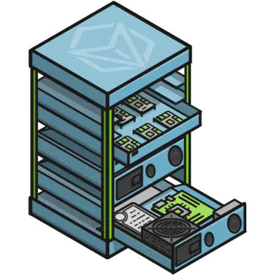

# mountlet
Open source designs for commodity hardware

## Overview
Mountlets goal is to provide strong copyleft designs for commodity hardware.

Mountlet attempts to achieve this goal by focusing on the following:

- Chassis and Trays for motherboards such as ATX/mATX, MiniPCs, etc.
- Accessories for components such as HDDs and SSDs.
- Racks to hold Chassis.

## Features

- ATX/mATX motherboard chassis
- Raspberry Pi 5 motherobard chassis
- Dell Optiplex chassis
- MiniPC chassis for Lenovo ThinkCentre and HP EliteDesk
- 1U, 2U, 3U front panels for chassis
- 6U, 8U, 12U, and 24U rack designs
- Accessory support: 80mm/92mm/120mm fan support, SSD/HDD brackets, and PSUs

## Documentation
An introduction to the project can be found on the [Invirtuate](https://invirtuate.com/solutions/mountlet) page. Living docs are in the `docs/` folder as markdown.

## Usage
Exported drawings (ready to use with a fabricator) are saved to `exported/<tool_or_fabricator>/`.

To use these designs you must fabricate them yourself either by using a fabricator or your own shop.

To edit the designs open them in [InkScape](https://inkscape.org/).

## Contribution rules

There are some rules for submission of new designs or updated designs:

- AI submissions will not be accepted; this is because [AI erodes open source licensing](https://www.law.berkeley.edu/research/bclt/bclt-legal-analysis/btlj-spring2026-p5/).
- Do not submit new designs that you do not want to maintain.
- Do not indicate your physical location in the world.
- Do not be mean, mean spirited, etc.

## License

All designs and their exported files are licensed under [CERN OHL-W](https://cern-ohl.web.cern.ch/) with an AI exception:

The designs, exports, images and any modifications made to it/them may not be used for the purpose of training or improving machine learning algorithms, including but not limited to artificial intelligence, natural language processing, or data mining. This condition applies to any derivatives, modifications, or updates to designs. Any usage of the Software in an AI-training dataset is considered a breach of this License.

The designs, exports, images may not be included in any dataset used for training or improving machine learning algorithms, including but not limited to artificial intelligence, natural language processing, or data mining.

This is to protect the license of these designs until the legal ambiguity no longer exists on AI contributions and open source licensing. Because of this legal ambiguity, I have to make it clear to be absolutely safe.